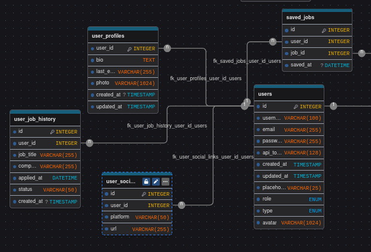
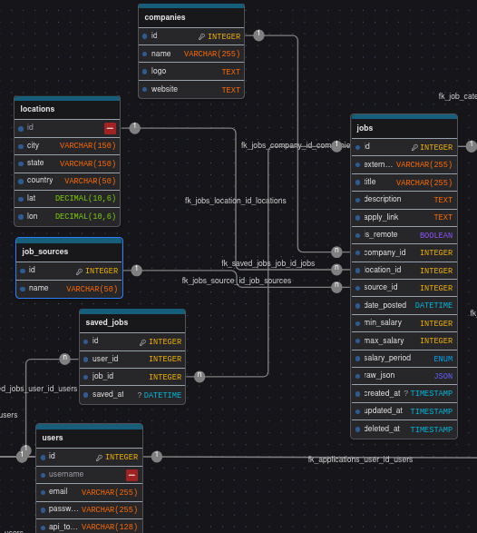
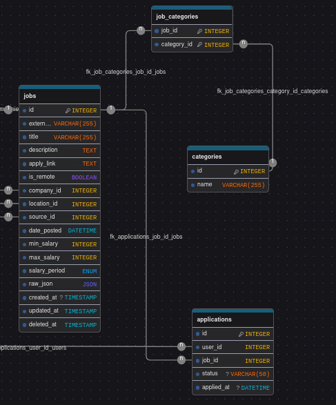

| Nama | NRP | Kelas |
| ---  | --- | ----------|
| Ahmad Satrio Arrohman | 5025241061 | Pemrograman Web - B |
| Ahsin Khuluqil Karim | 5025241063 | Pemrograman Web - B |
| Liem, Alfred Haryanto | 5025241100 | Pemrograman Web - B |

# ConnetIn Application
## Laporan Proyek
## 1. Frontend & Backend Development
a. Frontend
# Design v1 

# Hasil Implementasi (raw)

Nama file : `index.html` & `styleIndex.css`  
Styling : Bootstrap & CSS   
Description : Page ini merupakan home page atau main page dari aplikasi ConnectIn. Terdapat sidebar minimalis dengan sejumlah 3 tombol. 2 tombol diatas yang mewakili home page dan dashboard page untuk admin dan user, serta tombol di bagian bawah yang mewakili tombol logout. 

Nama file : `editProfile.html` & `styleIndex.css`  
Styling : Bootstrap    
Description : Pagi edit profile ini tergabung dalam rumpun dashboard user dan admin. Isi page ini antara lain form untuk mengubah data - data dari akun kita, seperti `Callname`, `Username`, `Bio`, dan juga `Education`. Terdapat juga placeholder untuk profile pic image pada bagian tengah atas. 

Nama file : `login.html` & `styleLoginRegister.css`  
Styling : Bootstrap & CSS   
Description : Implementasi login page secara simple, dimana untuk login maka membutuhkan kredensial user seperti username dan password serta dapat login menggunakan google. 

Nama file : `register.html` & `styleLoginRegister.css`  
Styling : Bootstrap & CSS    
Description : Implementasi register page secara simple, dimana untuk registrasi membutuhkan username, password, dan juga confirm password. 

Dengan penambahan : 

Nama file : `404.html` & `styleLoginRegister.css`  
Styling : Bootstrap & CSS    
Description : Page untuk 404 not found. 

Nama file : `403.html` & `styleLoginRegister.css`  
Styling : Bootstrap & CSS    
Description : Page untuk 403 forbidden. 

b. Backend

## 2. Database Implementation
  
Deskripsi : Pada potongan gambar database diatas, dapat terlihat beberapa tabel yang mewakili data-data yang berhubungan dengan user, seperti `user_profile`, `user_job_history`, `user_social_link`, `saved_job`, dan `users`. `user_profile` menyimpan data-data seperti user id, biodata, hingga foto profil dari akun user. `user_job_history` menyimpan nama pekerjaan, nama perusahaan, tanggal apply, status, dan kapan application dibuat. `user_social_link` sendiri berisi user id, platform, dan url nya. Tabel `saved_job` bertugas untuk menyimpan data pekerjaan yang di save oleh user, dan terakhir untuk tabel `user` menyimpan credential dari user seperti username, password, email, dan lain-lain. 

  
Deskripsi : Untuk potongan gambar kedua ini, berfokus pada tabel-tabel yang berhubungan dengan pekerjaan itu sendiri, meliputi tabel `companies`, `location`, `job_source`, dan `jobs`. Tabel `companies` merupakan tabel yang menyimpan data-data perusahaan seperti nama dari perusahaan itu, logo, dan website perusahaan. `jobs` merupakan tabel yang menyimpan detail setiap lowongan pekerjaan. Data yang tersimpan mencakup judul, deskripsi, apply_link, dan detail gaji. `locations` akan menyimpan informasi geografis (tempat) yang terkait dengan pekerjaan atau perusahaan, termasuk city, state, country, hingga koordinat latitude dan longitude. `job_sources` bertugas untuk menyimpan sumber asal dari data pekerjaan (nama).

  
Deskripsi : Pada potongan gambar ketiga ini terdapat 3 tabel terakhir, yakni `job_categories`, `categories`, dan `applications`. `job_categories` akan menyimpan job id dan juga kategorinya. `categories` merupakan tabel yang terhubung langsung dengan `job_categories`, menyediakan nama untuk job id. Terakhir, tabel `applications` akan menyimpan data status application dari user. 

## 3. Integrasi API

## Diagram Sistem

## User Guide

## Pembagian Jobdesk
| Nama | NRP | Jobdesk |
| --- | --- | --- |
| Ahmad Satrio Arrohman | 5025241061 | Backend |
| Ahsin Khuluqil Karim | 5025241063 | Frontend |
| Liem, Alfred Haryanto | 5025241100 | UI/UX & Frontend |