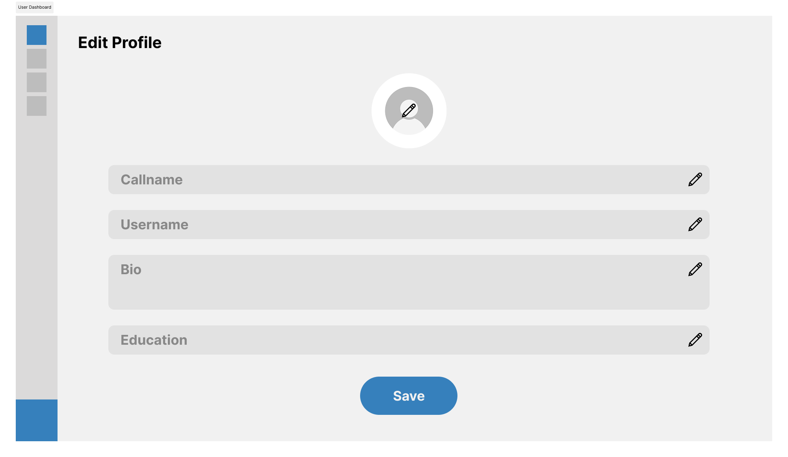
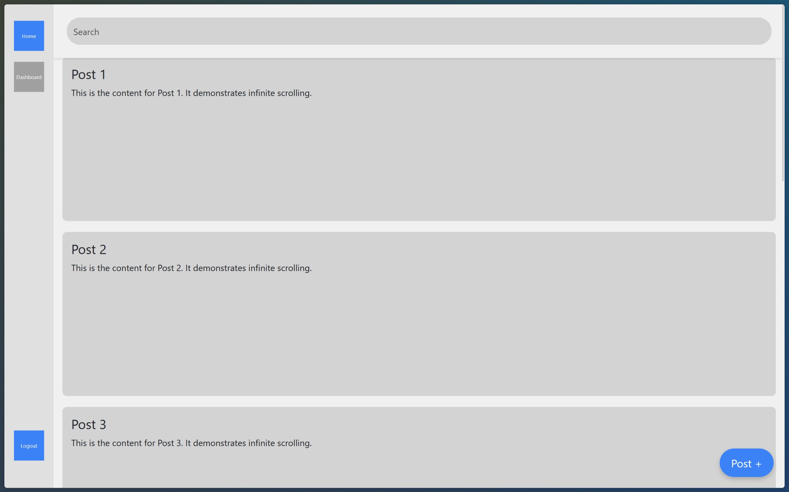
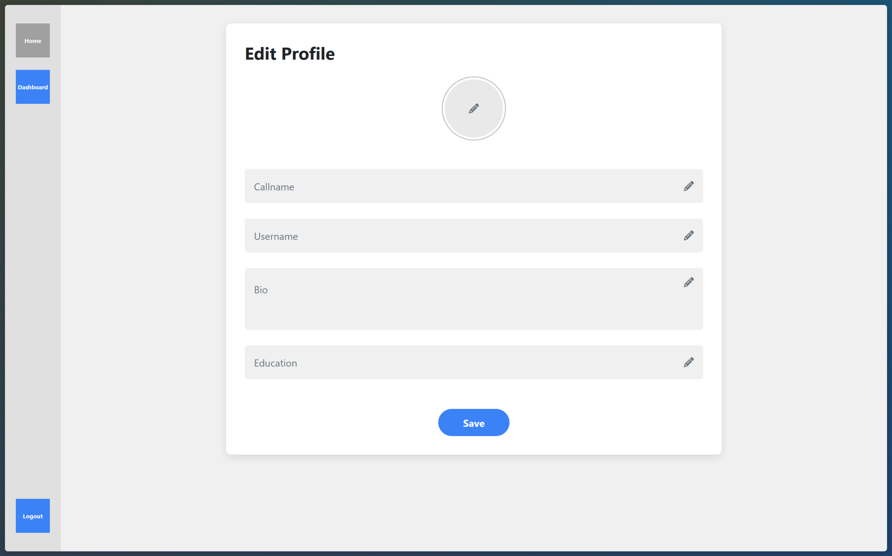
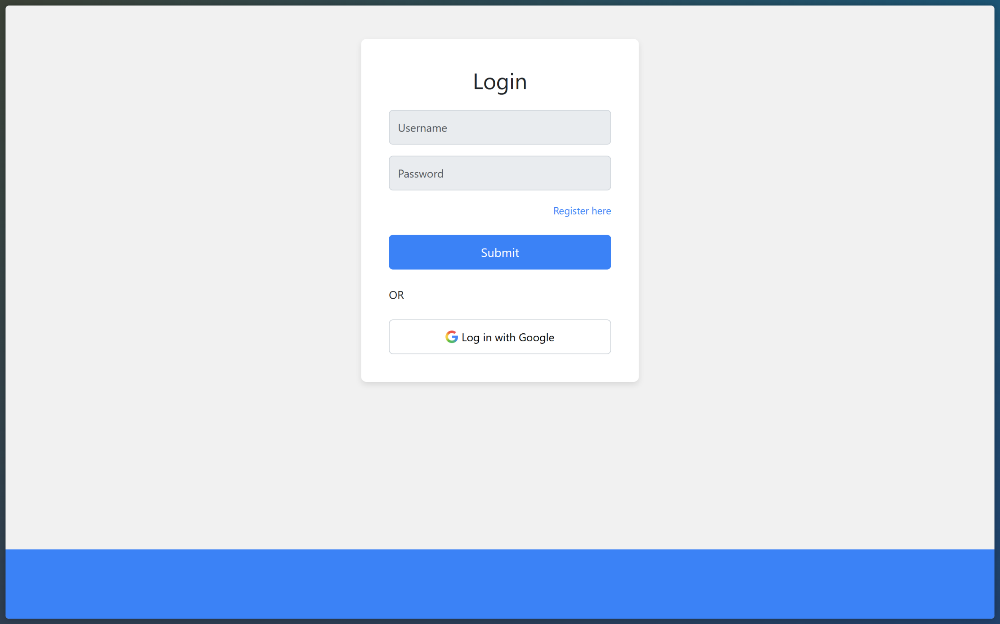
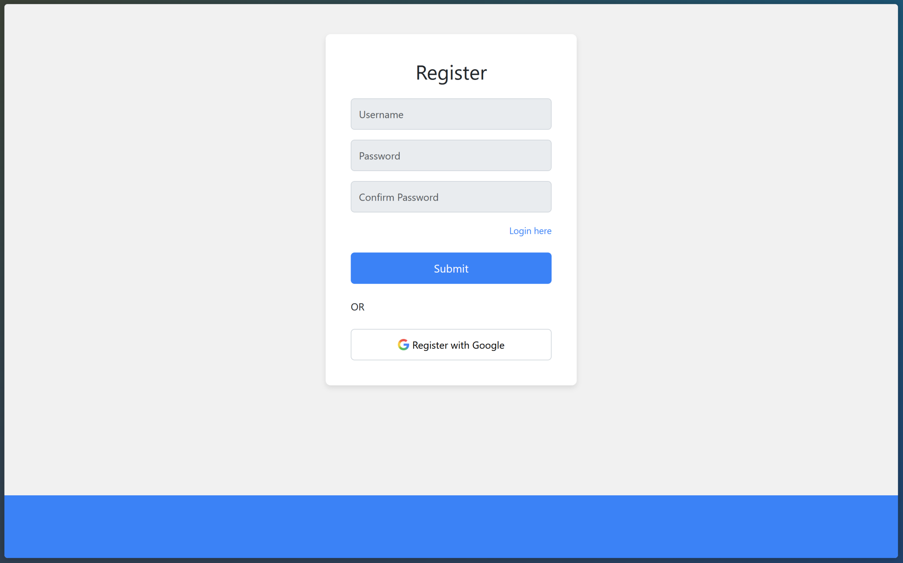
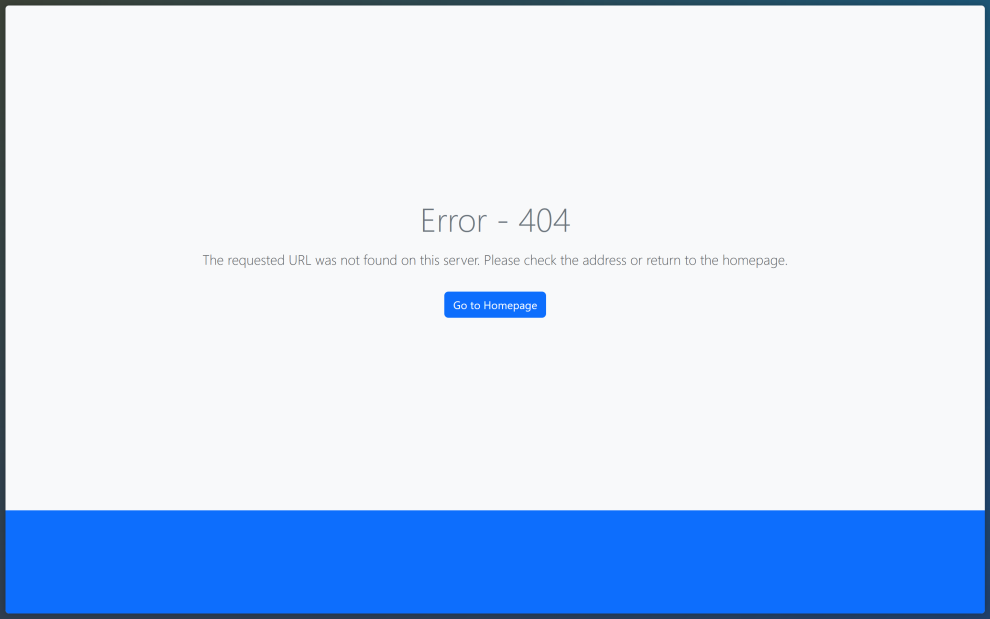

# Final Project for Web Programming Lecture

# Design v1 

# Hasil Implementasi (raw)

Nama file : `index.html` & `styleIndex.css`  
Styling : Bootstrap & CSS   
Description : Page ini merupakan home page atau main page dari aplikasi ConnectIn. Terdapat sidebar minimalis dengan sejumlah 3 tombol. 2 tombol diatas yang mewakili home page dan dashboard page untuk admin dan user, serta tombol di bagian bawah yang mewakili tombol logout. 

Nama file : `editProfile.html` & `styleIndex.css`  
Styling : Bootstrap    
Description : Pagi edit profile ini tergabung dalam rumpun dashboard user dan admin. Isi page ini antara lain form untuk mengubah data - data dari akun kita, seperti `Callname`, `Username`, `Bio`, dan juga `Education`. Terdapat juga placeholder untuk profile pic image pada bagian tengah atas. 

Nama file : `login.html` & `styleLoginRegister.css`  
Styling : Bootstrap & CSS   
Description : Implementasi login page secara simple, dimana untuk login maka membutuhkan kredensial user seperti username dan password serta dapat login menggunakan google. 

Nama file : `register.html` & `styleLoginRegister.css`  
Styling : Bootstrap & CSS    
Description : Implementasi register page secara simple, dimana untuk registrasi membutuhkan username, password, dan juga confirm password. 

Dengan penambahan : 

Nama file : `404.html` & `styleLoginRegister.css`  
Styling : Bootstrap & CSS    
Description : Page untuk 404 not found. 

Nama file : `403.html` & `styleLoginRegister.css`  
Styling : Bootstrap & CSS    
Description : Page untuk 403 forbidden. 
